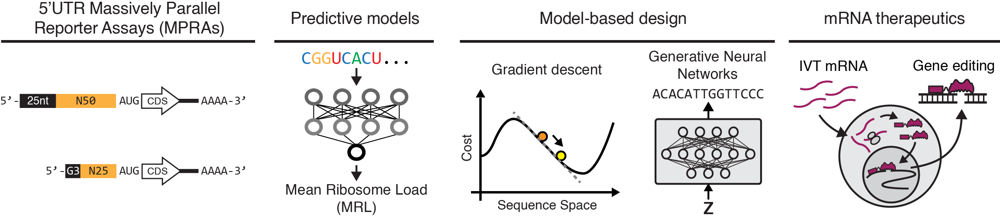

# Optimizing 5’UTRs for mRNA-delivered gene editing using deep learning

This repository contains data analysis and sequence design code from [Castillo-Hair et al. *Optimizing 5’UTRs for mRNA-delivered gene editing using deep learning*](https://www.biorxiv.org/content/10.1101/2023.06.15.545194v1.abstract).

## Contents

### Polysome profiling MPRAs

- [`analysis_cell_type`](analysis_cell_type): Data analysis of fixed-end libraries in HEK293T, T cells, and HepG2 (Figure 1 and related Supplementary Figures).
- [`analysis_random_end`](analysis_random_end): Data analysis of random-end libraries. Also contains training code and weights for Optimus 5-Prime (25) (Figure 3 and related Supplementary Figures).

### Sequence design

- [`megatal_5utr_design`](megatal_5utr_design): Notebooks and scripts for 5'UTR design, used in megaTAL gene editing assays (Figures 2 and 4 and related Supplementary Figures).

### Gene editing results analysis

- [`megatal_gene_editing_analysis`](megatal_gene_editing_analysis): Code for analysis of megaTAL gene editing results (Figures 2 and 4 and related Supplementary Figures).
- [`megatal_mrl_stability`](megatal_mrl_stability): Data and code for analysis of megaTAL direct MRL and stability measurements (Figure 5 and related Supplementary Figures).

### Others

- [`models_sample2019`](models_sample2019): Deep learning models from [Sample, et al. Nat. Biotech 2019](https://doi.org/10.1038/s41587-019-0164-5) must be downloaded and placed here for the code in this repo to work. See README file inside.
- [`polysome_profiling_data`](polysome_profiling_data): Polysome profiling data collected in this study must be placed here for the code in this repo to work. See README file inside.
- [`polysome_profiling_sample2019`](polysome_profiling_sample2019): Polysome profiling data collected in [Sample, et al. Nat. Biotech 2019](https://doi.org/10.1038/s41587-019-0164-5) must be downloaded and placed here for the code in this repo to work. See README file inside.

## Requirements
All code was written in Python 3. With the exception of the sequence design code (`megatal_5utr_design`), the following package versions were used:
- `matplotlib` 3.5.1
- `numpy` 1.22.1
- `pandas` 1.4.3
- `scikit-learn` 1.0.2
- `scipy` 1.7.3
- `seaborn` 0.12.2
- `tensorflow` 2.7.0

For sequence design, the following are required:
- [`isolearn`](https://github.com/johli/isolearn/) 0.2.1
- [`Fast SeqProp`](https://github.com/johli/seqprop/) 0.1
- [`DEN`](https://github.com/johli/genesis/) 0.1
- `keras` 2.2
- `tensorflow` 1.15

All standard packages can be installed with `pip` or `conda`. For `isolearn`, `Fast SeqProp`, and `DEN`, follow the instructions in the respective repos.

## Usage
Most of the analysis code is in Jupyter notebooks, each of which can be opened and run to reproduce a specific analysis or design task.
